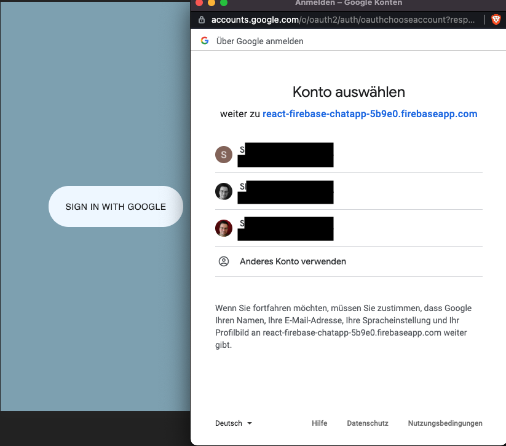
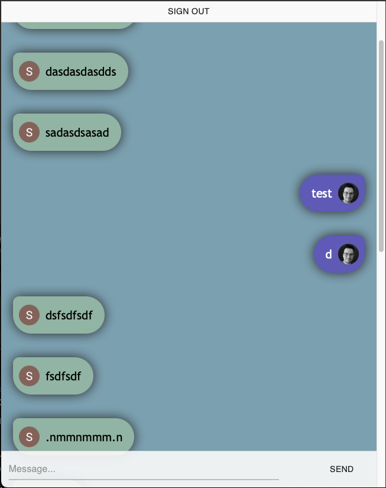

# React based firebase-chatApp

**THIS IS A NON-COMMERCIAL-PROJECT CREATED WITH REACT & FIREBASE**

This is a very simple two-person chat application. The core-idea and interest of making this app was to learn about the Google-Sign-In function via Firebase and implement it to a real-life app.

Current version: 1.0 || 23.03.2021

## Screenshots

## 🖱 Deployment

This app is actaully not deployed

## 📲 Design and layout infos

Designed for web & mobile

## 🔧 Development

### Requirements

Node.js and npm

### 👨‍💻 Install all dependencies

`npm install`

Since there is a postinstall, the system automatically searches the client folder and installs the required dependencies there, too.

### 📜 .env

You need to initialize your own firebase and an firebase API Key.
An example .env is already included.
